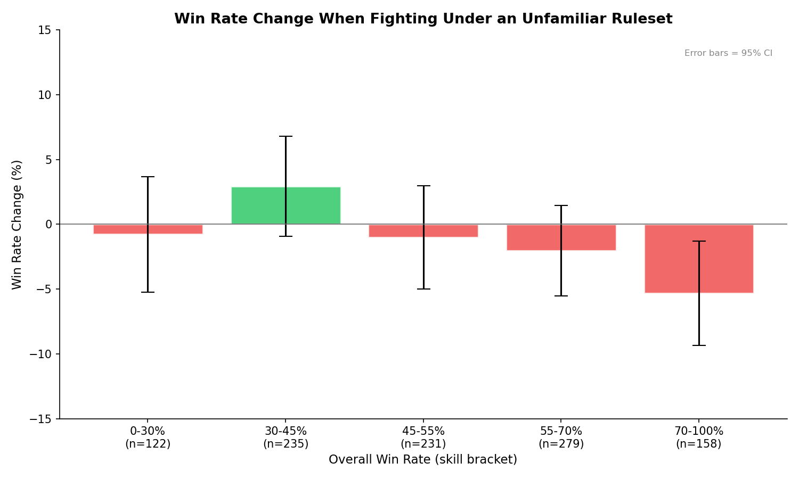
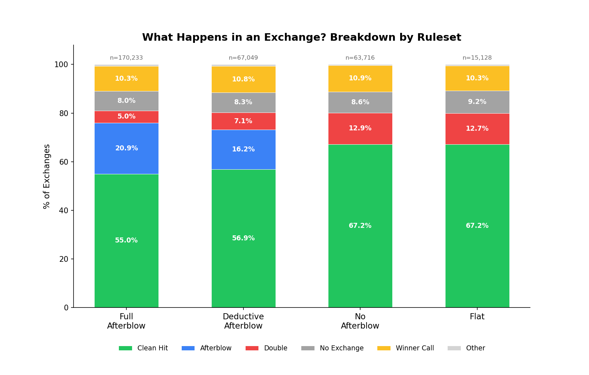
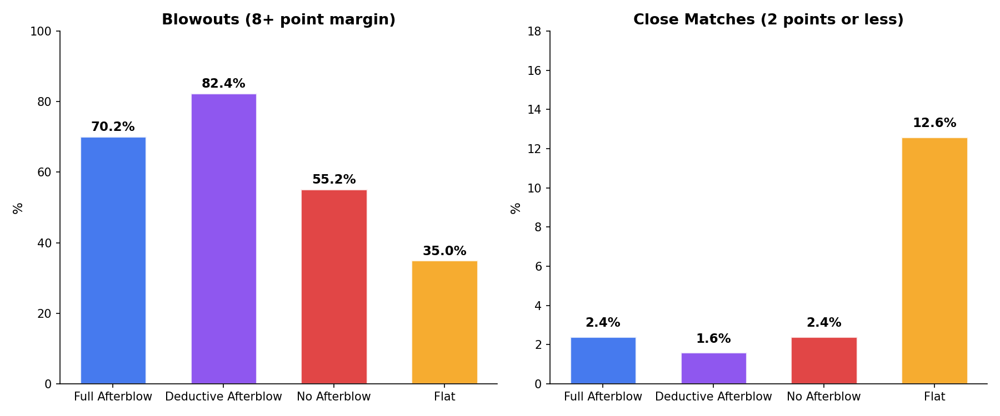

At every HEMA tournament I've been to, someone is complaining about the ruleset. "This scoring favors deep or light targets." "Afterblow rules reward sloppy fencing." "Flat scoring is a coin flip." The community has strong opinions about which rulesets produce the best fencing, but nobody's actually checked the data at scale.

Using data pulled directly from [HEMA Scorecard](https://hemascorecard.com), I looked at 621 tournaments and over 314,000 individual exchanges across four major ruleset families. The dataset spans events from 2015 through some of the latest in 2026, with the majority of the data in the 2022-2025 range.

---

Longsword tournaments on HEMA Scorecard can be assigned into one of four categories based on how they handle target scoring and simultaneous actions. Afterblow definitions vary by event, so we roughly use the categories as reported in the scorecard data.

**Weighted + Full Afterblow** scores head and thrust hits at 3 points, limbs at 1. If your opponent lands an afterblow, they score the full value of their hit too. (Clash for the Cash, CombatCon.)

**Weighted + Deductive Afterblow** uses the same weighted targets, but the afterblow value is reduced. Land a 3-point head cut and receive an afterblow to the torso, your opponent only gets 1 or 2 instead of 3. (SoCal Swordfight, Donnybrook, AG Open.)

**Weighted, No Afterblow** has weighted target values, but only the initial hit counts. No afterblow rules. (Black Horns Cup, FechtBerg, Swordmasters Cup.)

**Flat Scoring** gives every hit 1 point regardless of target. No afterblow rules. (Typically smaller events)

| Family | Events | Matches | Exchanges |
|--------|--------|---------|-----------|
| Full Afterblow | 217 | 16,807 | 168,922 |
| Deductive Afterblow | 107 | 7,123 | 66,505 |
| No Afterblow | 94 | 7,061 | 63,469 |
| Flat | 42 | 1,517 | 15,036 |

---

So, does the ruleset pick a winner? I tracked 1,499 fighters who competed under 2 or more different ruleset families, and compared their win rates across systems.

An interesting graph with its own takeaways, like a Dunning-Kruger effect for tournament win rate based on ruleset familiarity. But across every skill bracket, the win rate change from an unfamiliar ruleset doesn't appear to affect performance more than 5% of the time. Paired comparisons between every combination of ruleset families also show no significant differences (all effect sizes d < 0.07, all p > 0.05).

Individual variation is large, though. The interquartile range is -21.7% to +19.4%, meaning some fighters do swing substantially between rulesets. But those swings go in both directions equally, and are likely explained by small sample sizes for individual fighters rather than a systematic ruleset effect.

The 1,499 cross-ruleset fighters are also self-selected. These are people who travel to events with different rulesets, and they may be more adaptable than the average competitor. The null result holds for this population, but we can't say for certain it would hold for fighters who only ever compete locally.

---

So what does a ruleset actually change? The exchange-level data is where the differences show up.

Afterblow events have almost twice as many mutual scoring exchanges as no-afterblow events. The doubles rate drops from 13% to 5%, but 16% to 21% afterblows take their place. The total rate of "both fighters involved in scoring" goes from 13% (no afterblow) to 26% (full afterblow).

One community narrative is that afterblow rules "reduce doubles" by punishing simultaneous hits. The afterblow mechanism doesn't stop fighters from hitting each other at the same time. It *reclassifies* those exchanges. What would be a double (zero, or "negative" points each) tends to become an afterblow (asymmetric points favoring the initial attacker).

Under full afterblow, receiving an afterblow erases roughly 75% of your scoring exchange. You land a clean head cut worth 3 points, your opponent hits your arm on the way out for 2, and you net less than a point. Under deductive afterblow you keep about 40%, but the opponent still claws back more than half. This is the core incentive that shapes how people fight under afterblow rules: get in, hit, get out before the afterblow lands.

Under no-afterblow rules, a double is mutual destruction. Both fighters wasted an exchange, and are typically punished via tiebreakers and total point scoring systems. Under afterblow rules, the initial attacker still comes out ahead. The afterblow is a consolation prize, not a punishment.

---

What about match competitiveness? This is where the most dramatic difference in the data shows up.

Flat scoring produces roughly 4 to 5 times more close matches (within 2 points) than any weighted system. Under deductive afterblow, 82% of matches are blowouts (8+ point margin) and only 1.3% are close. Under flat scoring, about 1 in 14 matches comes down to 2 points or less.

Flat scoring also produces lower total point counts per match (6.7 vs 17.3 for full afterblow), which mathematically compresses margins. A 2-point gap in a flat match is a larger proportion of the total score than a 2-point gap in a weighted match. The absolute margin difference is real, but the scale difference means these numbers aren't directly comparable without normalization. Even so, flat scoring still produces more close matches no matter how you slice it.

"Close" also means different things depending on the scoring scale. A 2-point margin in flat scoring is two full exchanges. In a weighted system that scores 2- and 3-point exchanges, a 3-point margin could be a single exchange apart — arguably closer in terms of actual fencing, but it wouldn't qualify as "close" by the absolute point threshold used here. The close match metric captures point compression, not competitive tension, and those aren't always the same thing.

Weighted scoring multiplies small skill advantages. If you consistently hit the head (3 points) while your opponent hits your arm (1 point), weighted scoring turns a slight technical edge into a rout. Flat scoring compresses this, so every hit counts the same and the match stays closer even when one fighter has better target selection.

---

What don't the numbers capture?

Afterblow definitions aren't standardized. What counts as an "afterblow" versus a "double" varies by event. For this analysis, we rely on how each event's staff categorized exchanges in HEMA Scorecard. An afterblow is assumed to be a single or two-tempo hit after the first scoring action. If both fighters strike at the same time, it should be recorded as a double. In tournaments that don't score afterblows, simultaneous, single-tempo, and two-tempo responses are all recorded as doubles. Misclassification between these categories is certainly present in the data.

More importantly, the significant majority of tournaments coded as "afterblow" in Scorecard likely don't count afterblows in the way the term is understood today. The time window these events use for an afterblow is more or less the same as what a deductive afterblow tournament would call a double. The "afterblow" label in Scorecard dates back to 2015 when the software was first built, and the terminology has since shifted in the community. This means the data probably overstates the practical difference between afterblow and non-afterblow formats. Many "afterblow" events are functionally closer to deductive double-penalty systems than to true afterblow scoring.

Target recording depends on users. No-afterblow events record target information at much lower rates than afterblow events, so the target distribution comparison across families isn't reliable. Since Scorecard tournament staff fill out the data, misclassified exchanges, missed afterblows, and inconsistent target labeling are all in there. With 314,000 exchanges the noise should average out for aggregate statistics, but individual tournament numbers should be taken with a grain of salt.

Event difficulty isn't controlled. CombatCon and a local 16-person regional are both "full afterblow" events, but the competition level is wildly different. The fighter performance analysis controls for this by using within-fighter comparisons, but the exchange-level analysis doesn't.

The four families aren't exhaustive. Some tournaments use capped afterblows, escalating double penalties, or hybrid systems that don't fit neatly into these categories. I excluded those events from the analysis. The four families cover the large majority of longsword tournaments on HEMA Scorecard, but not all of them.

Skill of high value targets. While some targets may be worth more points, hitting a deep target isn't always more skillful. It's generally considered harder to hit a deep target, but I'd like to think the more skilled fighter is the one having the most fun.

---

Rulesets incentivize fighting styles that change how the fighting feels and how competitive the matches are.

Weighted scoring with deductive afterblow rewards clean, decisive fencing where the better fighter wins by a clear margin. Flat scoring creates closer matches where any exchange could swing the outcome. No afterblow lets fighters trade freely, and the 13% doubles rate is a feature of the format, not a failure.

There are things this analysis doesn't answer. Does the afterblow reclassification effect hold when you control for judge training? Do fighters who train specific rulesets to prepare for a tournament outperform the average fighter who just trains to "get good"?

If you see something I missed or want to dig into a specific angle, reach out!

---

*Data sourced from [HEMA Scorecard](https://hemascorecard.com). Fighter cross-referencing used [HEMA Ratings](https://hemaratings.com) for identifying competitors across events. Thanks to Sean Franklin for building Scorecard and making this kind of analysis possible.*
